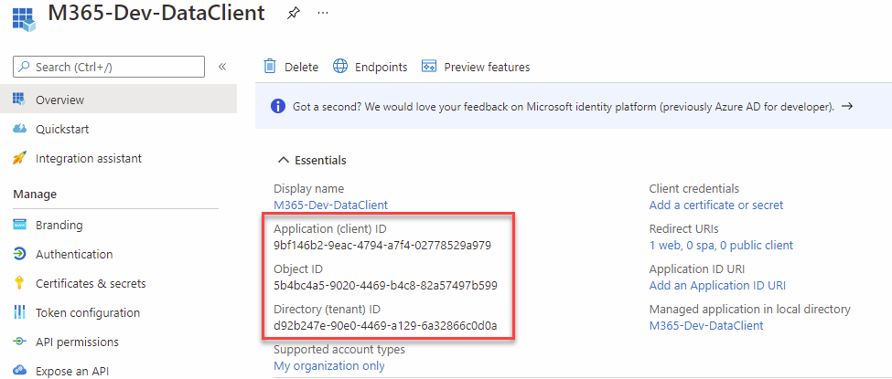
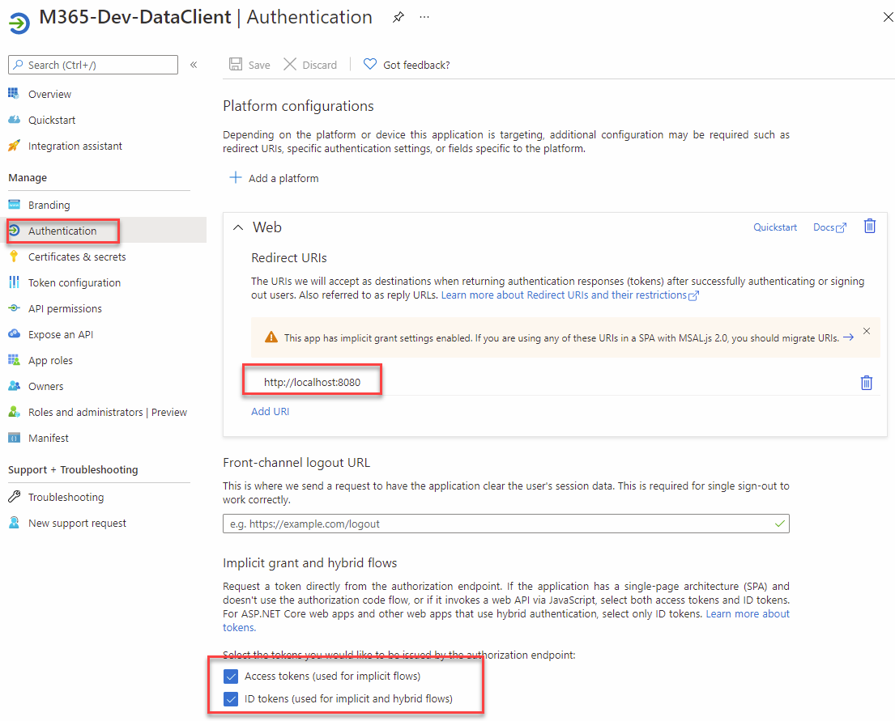
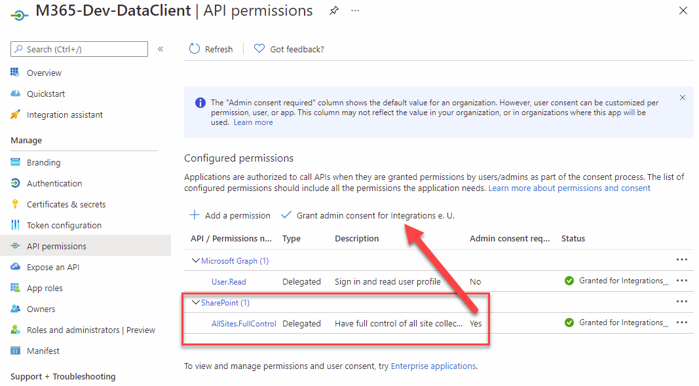

# Use SharePoint Rest Api from Node Stand-Alone

[SharePoint REST Service Docs](https://docs.microsoft.com/en-us/sharepoint/dev/sp-add-ins/get-to-know-the-sharepoint-rest-service?tabs=csom)

[SharePoint .NET Server, CSOM, JSOM, and REST API index](https://docs.microsoft.com/en-us/sharepoint/dev/sp-add-ins/sharepoint-net-server-csom-jsom-and-rest-api-index)

[SP Insider - Chrome Extension](https://chrome.google.com/webstore/detail/sp-insider/gjckpigahcbffmeofjfedlffddhfidhj)

## Demo

- Use Node 12.x
- Go to `https://aad.portal.azure.com/#blade/Microsoft_AAD_IAM/ActiveDirectoryMenuBlade/RegisteredApps`
- Create an App Registration and update `msal-config.json`

    

    

    

- Install http-server using `npm i -g http-server`    
- Excute http-server in proj folder and open `http://localhost:8080`