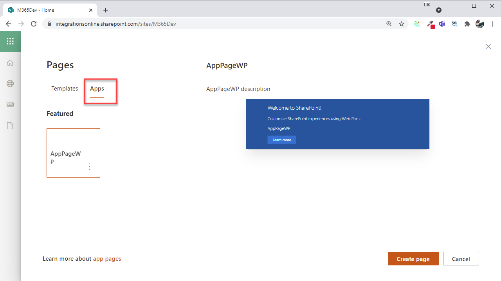

# App Page

- Update WebPart Maifest:
    ```
    "supportedHosts": ["SharePointWebPart", "SharePointFullPage"],
    ```
- Update `package-solution.json`:
    ```
    "skipFeatureDeployment": true,
    ```
- Build & Deploy WebPart. You dont need to add it to the site as it is deployed when adding the package
- From the Home Page add a new Page:

    