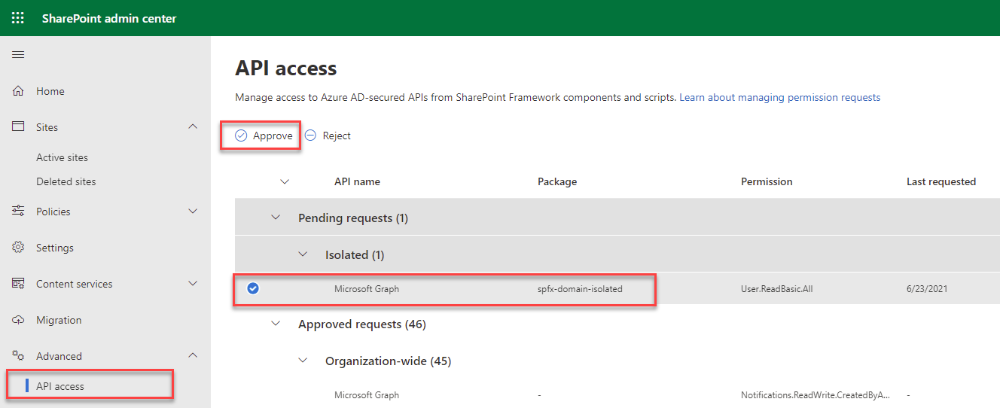

# Domain Isolated WebParts

2 Webparts included:

-   Call Third Party Api
-   Domain Isolated WP
-   Edit `package-solution.json`

    ```
    "isDomainIsolated": true,
    "webApiPermissionRequests": [
      {
        "resource": "Microsoft Graph",
        "scope": "User.ReadBasic.All"
      }
    ],
    ```

-   Package the webpart using `gulp bundle --ship` and `gulp package-solution --ship`
-   Make sure you are authenticated using M365 CLI: `m365 login`
-   Deploy the webpart using `m365 spo app add -p sharepoint/solution/sp-fx-rest.sppkg --overwrite`
-   Take the resulting id and deploy: `m365 spo app deploy -i 6636a58e-8139-4fab-adf3-458906f3189b`

Approve the API permission request fro Domain Isolated WP:

In the navigation of SharePoint Admin, select Advanced > API access:

Select the Pending approval for the Microsoft Graph permission User.ReadBasic.All


