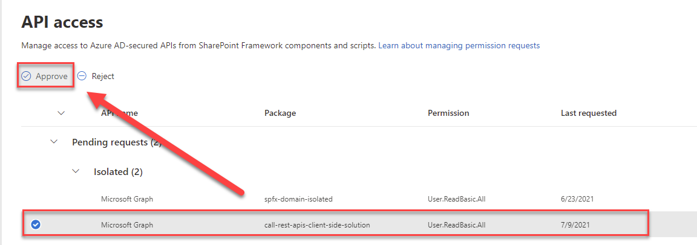

# Calling REST Apis

- Call Third Party Api
- Call Graph using AadHttpClient
- Domain Isolated WP

## Graph using AadHttpClient

- Edit `package-solution.json`

    ```
    "isDomainIsolated": true,
    "webApiPermissionRequests": [
      {
        "resource": "Microsoft Graph",
        "scope": "User.ReadBasic.All"
      }
    ],
    ```

-   Package the webpart using `gulp bundle --ship` and `gulp package-solution --ship`
-   Make sure you are authenticated using M365 CLI: `m365 login`
-   Deploy the webpart using `($id=m365 spo app add -p sharepoint/solution/call-rest-apis.sppkg --overwrite)`
-   Take the resulting id and deploy: `m365 spo app deploy -i $id`

Approve the API permission request fro Domain Isolated WP:

In the navigation of SharePoint Admin, select Advanced > API access:

Select the Pending approval for the Microsoft Graph permission User.ReadBasic.All



For your own understanding check the App Registration that has been created by approving the request.


## Secured Enterprise Api

