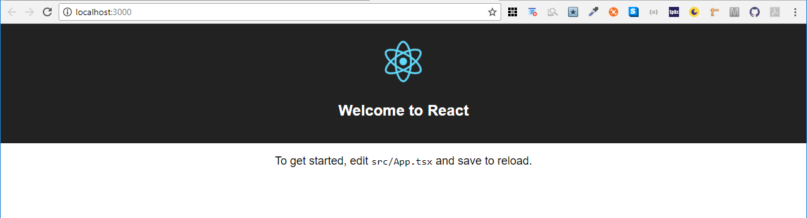
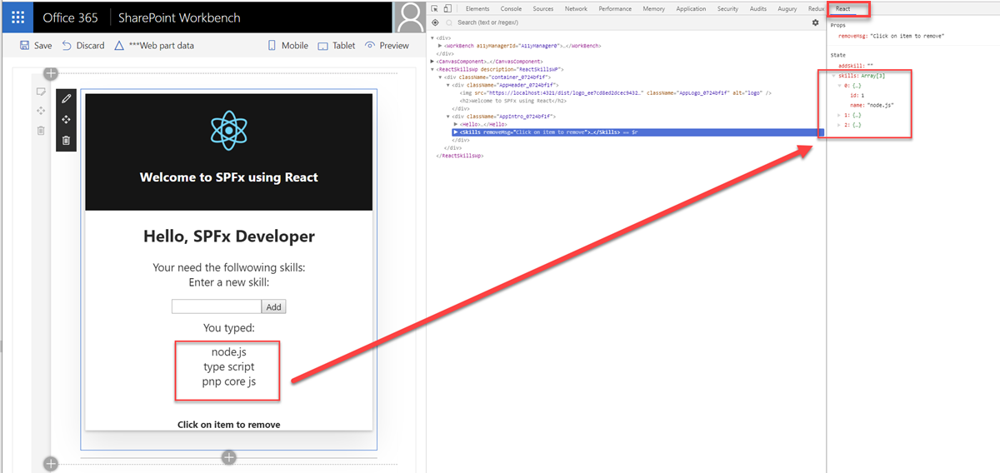

# React

## React TypeScript Scaffolding

[TypeScript React Starter](https://github.com/Microsoft/TypeScript-React-Starter)

npm install -g create-react-app

Create a class based project:

```
create-react-app skills-classes --typescript --scripts-version react-scripts@^2
```

Execute project:

```
npm run start
```

Running App:



## Proposed Chrome & VS Code Extensions

[React Dev Tools for Chrome](https://chrome.google.com/webstore/detail/react-developer-tools/fmkadmapgofadopljbjfkapdkoienihi?hl=en)



[Typescript React code snippets](https://marketplace.visualstudio.com/items?itemName=infeng.vscode-react-typescript)

[VSCode React Refactor](https://marketplace.visualstudio.com/items?itemName=planbcoding.vscode-react-refactor)
