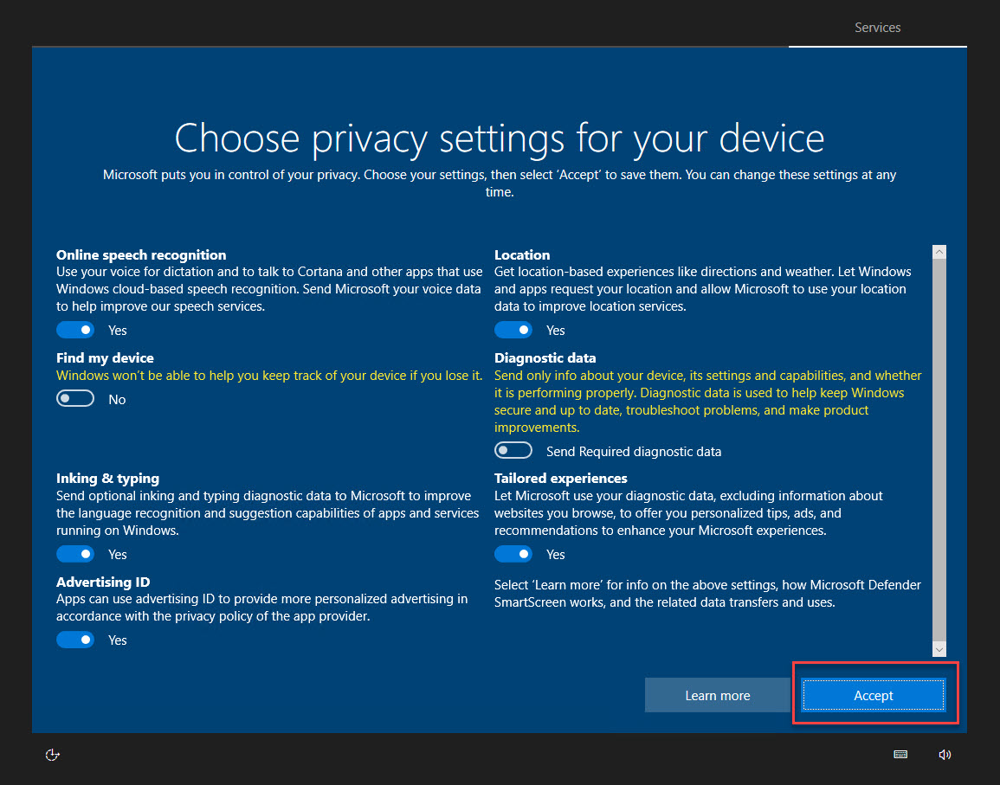

# Lab VM Setup Guide

This is a semin-automated guide for a Azure Lab VM Setup. Feel free to automate the missing steps on a seperate branch in your fork and create a pull request. An introduction video into forks and pull requests can be found [here](https://www.youtube.com/watch?v=nT8KGYVurIU)

Execute Azure CLI script `create-lab-vm.sh` in [Cloud Shell](../Tooling/04-CLI/):

```bash
curl https://raw.githubusercontent.com/arambazamba/ms-600/master/Setup/create-lab-vm.sh | bash
```


Note: The image name of the Windows 10:20h2 image changes frequently. You might have to update the image name. Get a list of all Windows 10 images: `az vm image list -f "Windows-10" --location westeurope --all`. Remember to support WSL2 you must have at least patch level `20h2`

## Connect to VM

Go to Ressource Group `ms600-lab` and connect to VM using RDP and the credentials that you have used in the script:

Download RDP File:


Optional - Disable Login:


Sign In & Remember:


Credentials:

```
user=azlabadmin
pwd=Lab@dmin1234
```


Accept Settings:



## Install Software

To install Software run the script `setup-ms-600.ps1` from an elevated PowerShell prompt:


```powershell
Set-ExecutionPolicy Bypass -Scope Process -Force;
Invoke-Expression ((New-Object System.Net.WebClient).DownloadString('https://raw.githubusercontent.com/arambazamba/ms-600/master/Setup/setup-ms-600.ps1'))
```

> Note: This script will run for approx 20 min. No need to wait! In the meantime you can continue to fork and clone my repo as described in the next section.

Congratulations you have completed the base setup of a labs vm!

---

## Fork & Clone Class Repo and set Github requirements

Set User and E-Mail in order to be able to commit to git:

```bash
git config --global user.name "Your Name"
git config --global user.email "your.email@yourdomain.com"
```

Go to `https://github.com/ARambazamba/ms-600` and fork the repo


The forking-workflow allows you to commit your changes to your fork of the repo and still get updates on the repo


Clone Class Repo:

```bash
git clone https://github.com/Student01/ms-600
```

> Note: If you have forked the class repo clone your own fork, otherwise use https://github.com/ARambazamba/ms-600
