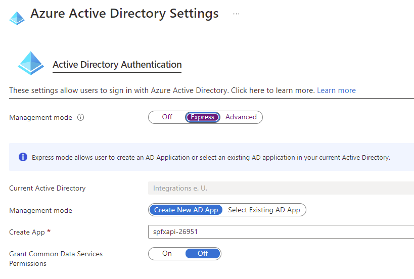
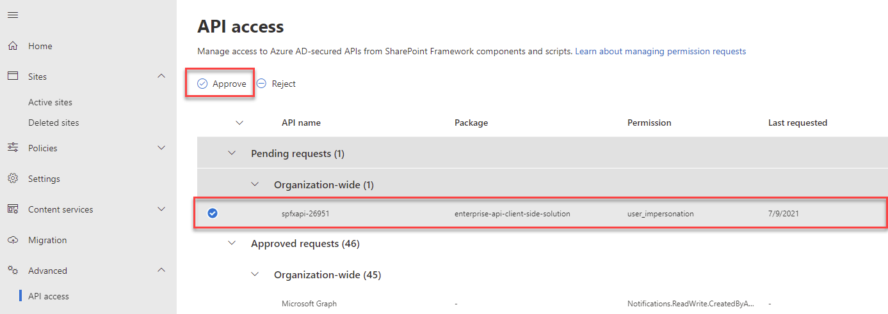

# Secured Enterprise Api

- Execute `create-func-app.azcli` and deploy `az-funct-skills`
- Enable auth
- Configure Azure AD auth

  

- Enable CORS on the function app for your SharePoint tenant.Example: `https://integrationsonline.sharepoint.com`

- Add permissions to `package-solution.json`

  ```
  "webApiPermissionRequests": [
    {
      "resource": "spfxapi-26951",
      "scope": "user_impersonation"
    }
  ],
  ```

-   Package the webpart using `gulp bundle --ship` and `gulp package-solution --ship`
-   Make sure you are authenticated using M365 CLI: `m365 login`
-   Deploy the webpart using `($id=m365 spo app add -p sharepoint/solution/enterprise-api.sppkg --overwrite)`
-   Take the resulting id and deploy: `m365 spo app deploy -i $id`  
-   In the navigation of SharePoint Admin, select Advanced > API access:

-   Select the Pending approval for the app concerning `user_impersonation`

    